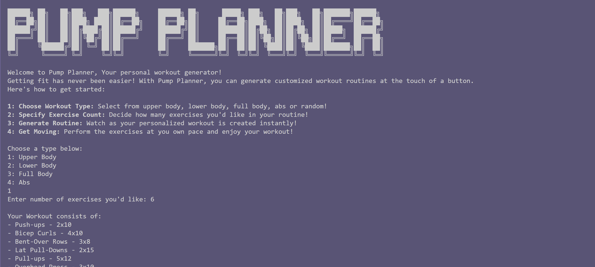

# Pump Planner
Pump Planner is a Python-based console application tailored for fitness enthusiasts at any skill level. 
Whether you're a beginner or an advanced athlete, Pump Planner can customize workout routines that cater to your goals, 
available equipment, and other preferences, helping you achieve your desired fitness results.

## Features
    1: Choose Workout Type: Select from upper body, lower body, full body, abs or random!
    2: Specify Exercise Count: Decide how many exercises you'd like in your routine!
    3: Generate Routine: Watch as your personalized workout is created instantly!
    4: Get Moving: Perform the exercises at you own pace and enjoy your workout!
### Getting Started
#### Installation
    git clone https://github.com/abbey-deniro/PumpPlanner.git
    cd PumpPlanner
#### Running the App
    python menu.py
